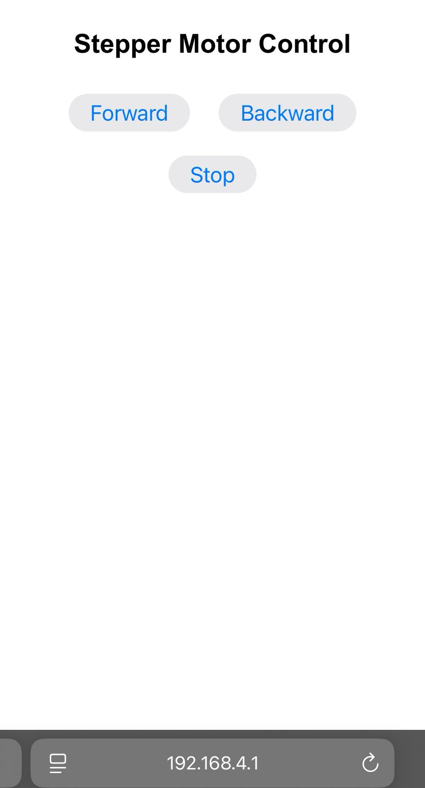
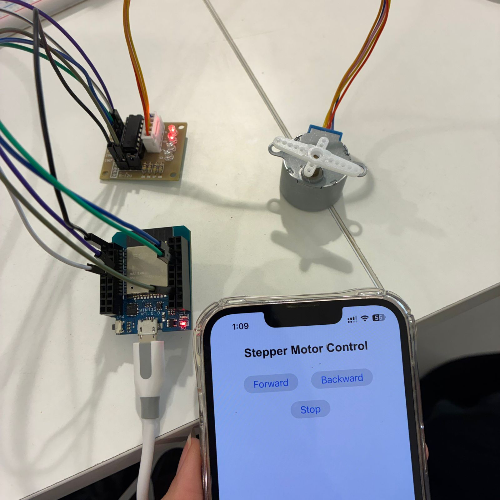

# ESP32 Stepper Motor Web Control

## Overview

This project demonstrates controlling a stepper motor using an ESP32 through a web interface.
The ESP32 creates a WiFi Access Point and hosts a webpage with control buttons.

---

## Features

* Control stepper motor wirelessly via web browser
* Forward and backward rotation
* Stop control
* No external app required (just a browser)

---

## Components

* ESP32
* 28BYJ-48 Stepper Motor
* ULN2003 Driver Board
* Jumper wires
* Breadboard (optional)

---

## Wiring

### ESP32 → ULN2003:

* IN1 → GPIO 18
* IN2 → GPIO 19
* IN3 → GPIO 21
* IN4 → GPIO 22

### Power:

* VCC → 5V
* GND → GND (common ground)

---

## Code

```cpp id="stepweb1"
#include <WiFi.h>
#include <WebServer.h>
#include <Stepper.h>

const char* ssid = "ESP32_Stepper";
const char* password = "12345678";

Stepper stepper(2048, 18, 21, 19, 22);
WebServer server(80);

String webpage = R"rawliteral(
<!DOCTYPE html>
<html>
<head>
  <title>Stepper Control</title>
  <meta name="viewport" content="width=device-width, initial-scale=1">
</head>
<body style="text-align:center;">
  <h2>Stepper Motor Control</h2>
  <button onclick="fetch('/forward')">Forward</button>
  <button onclick="fetch('/backward')">Backward</button>
  <button onclick="fetch('/stop')">Stop</button>
</body>
</html>
)rawliteral";

bool stopMotor = false;

void handleRoot() {
  server.send(200, "text/html", webpage);
}

void handleForward() {
  stopMotor = false;
  for (int i = 0; i < 2048 && !stopMotor; i++) {
    stepper.step(1);
  }
  server.send(200, "text/plain", "Forward");
}

void handleBackward() {
  stopMotor = false;
  for (int i = 0; i < 2048 && !stopMotor; i++) {
    stepper.step(-1);
  }
  server.send(200, "text/plain", "Backward");
}

void handleStop() {
  stopMotor = true;
  server.send(200, "text/plain", "Stopped");
}

void setup() {
  stepper.setSpeed(10);

  WiFi.softAP(ssid, password);

  server.on("/", handleRoot);
  server.on("/forward", handleForward);
  server.on("/backward", handleBackward);
  server.on("/stop", handleStop);

  server.begin();
}

void loop() {
  server.handleClient();
}
```

---

## How to Use

1. Upload the code to ESP32
2. Connect to WiFi:

   ```
   ESP32_Stepper
   ```
3. Open browser and go to:

   ```
   192.168.4.1
   ```
4. Use the buttons to control the motor

---

## Results

### Web Interface



### Hardware Setup



---

## Notes

* Ensure correct wiring order (IN1–IN4)
* Use external 5V supply if motor is weak
* Common ground is required

---

## Status

- Web control working
- Stepper motor rotates correctly
- Stable communication via ESP32

---
